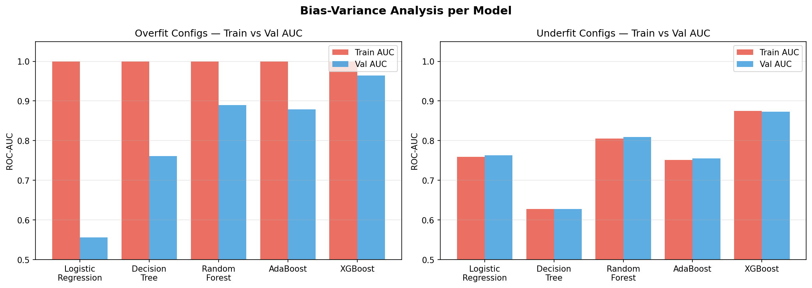
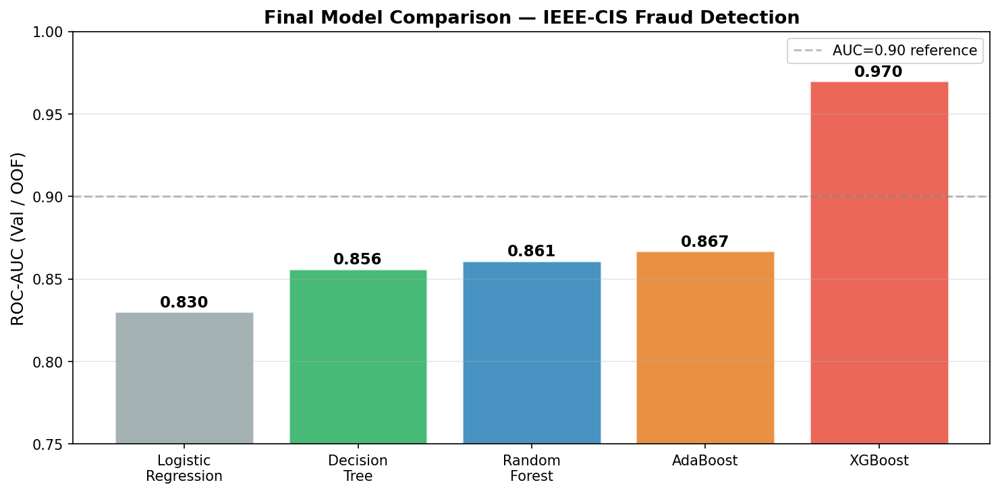
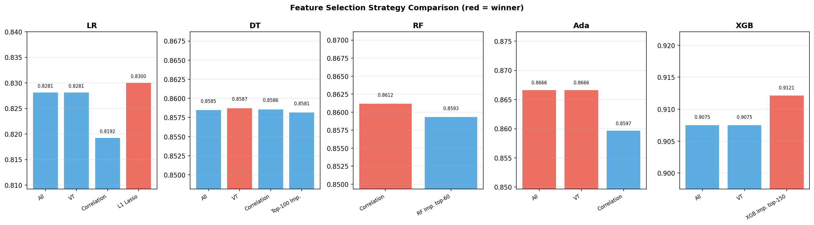
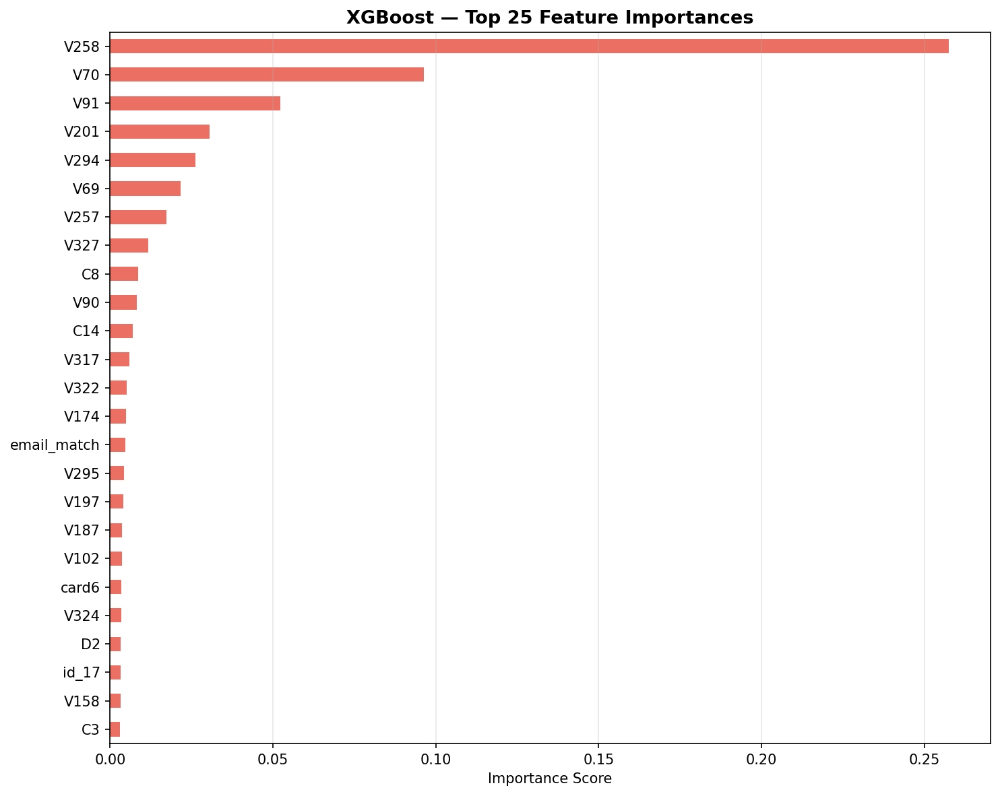

# IEEE-CIS Fraud Detection — Machine Learning პროექტი

## კონკურსის მოკლე მიმოხილვა

[IEEE-CIS Fraud Detection](https://www.kaggle.com/competitions/ieee-fraud-detection) არის Kaggle-ის competition. ამოცანა მდგომარეობს იმაში, რომ დავადგინოთ საბანკო ტრანზაქცია ყალბია (`isFraud=1`) თუ ნამდვილი (`isFraud=0`) — ეს არის binary classification პრობლემა.


---

## ჩემი მიდგომა

მოდელის სრული workflow:

```
Raw Data → Cleaning → Feature Engineering → Label Encoding + Imputation
        → Feature Selection → Underfit/Overfit Analysis
        → Hyperparameter Optimization → Final Pipeline → MLflow Registry
```

ყველა მოდელისთვის გამოვიყენე sklearn Pipeline, რომელიც raw test data-ზე პირდაპირ მუშაობს preprocessing-ის გარეშე. Pipeline-ი registered model-ის სახით ინახება MLflow Model Registry-ში.

---

## რეპოზიტორიის სტრუქტურა

```
IEEE-CIS-Fraud-Detection---Machine-Learning/
├── images/                                    # გრაფიკები README-თვის
│   ├── bias_variance_comparison.png           # underfit/overfit ანალიზი
│   ├── model_auc_comparison.png               # მოდელების AUC შედარება
│   ├── feature_importance_xgboost.png         # XGBoost feature importance
│   └── feature_selection_comparison.png       # feature selection სტრატეგიები
├── model-experiment-logisticregression.ipynb  # Logistic Regression
├── model-experiment-decisiontree.ipynb        # Decision Tree
├── model-experiment-randomforest.ipynb        # Random Forest
├── model-experiment-adaboost.ipynb            # AdaBoost
├── model-experiment-xgboost.ipynb             # XGBoost
├── model-inference.ipynb                      # საბოლოო Kaggle submission
└── README.md
```

**ფაილების განმარტება:**

| ფაილი | მიზანი |
|---|---|
| `model-experiment-{arch}.ipynb` | ყოველი მოდელის სრული pipeline: Cleaning → FE → FS → Training |
| `model-inference.ipynb` | MLflow Registry-დან საუკეთესო მოდელის ჩამოტვირთვა და test submission |
| `README.md` | პროექტის სრული დოკუმენტაცია |

---

## Data Cleaning

### Missing Values სტრატეგია

მონაცემებში სვეტების დიდ ნაწილს ბევრი გამოტოვებული მნიშვნელობა აქვს:

| missing % | სვეტების რაოდენობა |
|---|---|
| > 90% | ~14 სვეტი |
| > 50% | ~214 სვეტი |
| > 0% | ~350+ სვეტი |

სხვადასხვა მოდელში სხვადასხვა ზღვარი გამოვიყენე:

| მოდელი | Missing Threshold | ამოღებული სვეტები | დარჩენილი სვეტები |
|---|---|---|---|
| Logistic Regression | **0.50** | ~216 | 218 |
| Decision Tree | 0.90 | ~14 | 420 |
| Random Forest | 0.90 | ~14 | 420 |
| AdaBoost | 0.90 | ~14 | 420 |
| XGBoost | 0.90 | ~14 | 420 |

LR-ისთვის მკაცრი ზღვარი (0.5) გამოვიყენე, რადგან linear მოდელი sparse სვეტებს ეფექტურად ვერ ამუშავებს და noise-ი ზიანს მიაყენებდა. Tree-based მოდელები კი `fillna(-999)` ან median-ით უმკლავდებიან missing values-ს, ამიტომ 0.9 ზღვარი საკმარისია.

**Imputation სტრატეგია:**
- Numeric: `SimpleImputer(strategy='median')` — outlier-ების მიმართ მდგრადი
- XGBoost: `fillna(-999)` — XGBoost-ს built-in NaN handling აქვს, სენტინელი მნიშვნელობა სჯობს
- Categorical: `fillna('unknown')` → Label Encoding

**Class Imbalance:**
- Tree-based მოდელები: `class_weight='balanced'`
- AdaBoost: `sample_weight` ხელით გამოვთვალეთ (pos_weight = 27.58)
- XGBoost: `scale_pos_weight=27`

---

## Feature Engineering

ყველა მოდელში გამოვიყენე შემდეგი feature engineering მიდგომები:

### დროის ცვლადები (`TransactionDT`-დან)

| Feature | აღწერა | მიზეზი |
|---|---|---|
| `hour` | საათი (0–23) | fraud rate 4–10 საათში მაღალია (ხალხს სძინავს) |
| `dayofweek` | კვირის დღე (0–6) | დასვენების და სამუშაო დღეები განსხვავდება |
| `week` | კვირა წელში (0–51) | სეზონური პატერნები |
| `hour_sin`, `hour_cos` | cyclic encoding (LR-ისთვის) | Linear მოდელს cyclic feature სჭირდება |

### ტრანზაქციის თანხა (`TransactionAmt`)

| Feature | აღწერა | მიზეზი |
|---|---|---|
| `TransactionAmt_log` | `log1p(amt)` | right-skewed განაწილების გასწორება |
| `TransactionAmt_cents` | ათობითი ნაწილი | fraudsters მრგვალ თანხებს იყენებენ |
| `amt_is_round` | 1 თუ მთელი რიცხვია | იგივე |
| `amt_is_round_100` | 1 თუ 100-ის ჯერადია | იგივე |
| `TransactionAmt_capped` | p99-ზე clip (LR) | extreme outlier-ების შეზღუდვა |

### Email features

| Feature | აღწერა |
|---|---|
| `P_emaildomain_suffix` | გამგზავნის email TLD (.com, .net...) |
| `P_emaildomain_domain` | გამგზავნის email სახელი (gmail, yahoo...) |
| `R_emaildomain_suffix` | მიმღების email TLD |
| `R_emaildomain_domain` | მიმღების email სახელი |
| `email_match` | 1 თუ P_email == R_email |

### Group Aggregation features

ბარათ/მისამართ დონეზე სტატისტიკა:

| Feature | ჯგუფი | სტატისტიკა |
|---|---|---|
| `card1_amt_mean/std/max` | card1 | TransactionAmt-ის mean/std/max |
| `card4_amt_mean/std/max` | card4 | TransactionAmt-ის mean/std/max |
| `addr1_amt_mean/std/max` | addr1 | TransactionAmt-ის mean/std/max |
| `{g}_amt_zscore` | card1/4, addr1 | z-score (-5, 5 clip) |
| `uid_count/mean/std/max` | card1+card2+addr1+email | მომხმარებლის დონის სტატისტიკა |
| `user_amt_zscore` | user_id | ტრანზაქცია საშუალოდან რამდენად განსხვავდება |
| `user_count_log` | user_id | `log1p(uid_count)` |
| `user_amt_vs_max` | user_id | amt / uid_max (clip 0-1) |

**Features-ების ცვლილება:**

| მოდელი | Cleaning შემდეგ | FE შემდეგ | ახალი features |
|---|---|---|---|
| Logistic Regression | 218 | 233 | +15 |
| Decision Tree | 420 | 434 | +14 |
| Random Forest | 420 | 450 | +30 |
| AdaBoost | 420 | 444 | +24 |
| XGBoost | 420 | 432 | +12 |

---

## Feature Selection

### სტრატეგიები მოდელის მიხედვით

**Logistic Regression — 4 სტრატეგია:**

| სტრატეგია | Features | Val AUC |
|---|---|---|
| A — ყველა feature | 233 | 0.82812 |
| B — VarianceThreshold(0.05) | 233 | 0.82812 |
| C — Correlation ≥ 0.02 | 147 | 0.81923 |
| **D — L1 Lasso SelectFromModel** | **86** | **0.83003 ✓** |

→ L1 penalty-ით SelectFromModel საუკეთესოა. L1 regularization linear მოდელისთვის ბუნებრივი feature selector-ია — არარელევანტური coefficients-ები ნულამდე მიჰყავს.

---

**Decision Tree — 4 სტრატეგია:**

| სტრატეგია | Features | Val AUC |
|---|---|---|
| A — ყველა feature | 434 | 0.85845 |
| **B — VarianceThreshold(0.01)** | **409** | **0.85872 ✓** |
| C — Correlation ≥ 0.01 | 318 | 0.85855 |
| D — DT Importance top-100 | 100 | 0.85815 |

→ VarianceThreshold უკეთესი აღმოჩნდა ოდნავ. AUC-ები ძალიან ახლოსაა, რაც ნიშნავს Decision Tree-ს feature selection-ისადმი სენსიტიური არ არის — tree-ები არასაჭირო features-ებს ისედაც უგულებელყოფს.

---

**Random Forest — 2 სტრატეგია:**

| სტრატეგია | Features | Val AUC |
|---|---|---|
| **A — Correlation ≥ 0.005** | **360** | **0.86117 ✓** |
| B — RF Importance top-60 | 60 | 0.85933 |

→ Correlation filter საუკეთესოსა. 60 features-მდე შეკვეცა ოდნავ ამცირებს AUC-ს, რაც ნიშნავს რომ RF-ს 360 feature-ის კარგად გარჩევა შეუძლია parallel ხეებით.

---

**AdaBoost — 3 სტრატეგია:**

| სტრატეგია | Features | Val AUC |
|---|---|---|
| **A — ყველა feature** | **444** | **0.86663 ✓** |
| B — VarianceThreshold(0.01) | 419 | 0.86663 |
| C — Correlation ≥ 0.01 | 325 | 0.85966 |

→ ყველა feature-ის გამოყენება ან VarianceThreshold (AUC იდენტურია). AdaBoost weak learners-ს (depth-1 stump) იყენებს, ამიტომ ბევრი feature-ი redundant-ია — ამ შემთხვევაში selection ეფექტი მინიმალურია.

---

**XGBoost — 3 სტრატეგია:**

| სტრატეგია | Features | CV AUC |
|---|---|---|
| A — ყველა feature (No Selection) | 432 | 0.90751 |
| B — VarianceThreshold(0.01) | ~432 | 0.90751 |
| **C — XGBoost Importance top-150** | **150** | **0.91213 ✓** |

→ XGBoost Importance-based selection საუკეთესო აღმოჩნდა. importance-ის მიხედვით top-150 feature-ის შერჩევა noise-ს ამცირებს და უკეთ განაზოგადებს.

---

## Training

### Underfit / Overfit ანალიზი

ყველა მოდელში სპეციალურად, გამოყოფილად შევქმენი underfitting და overfitting კონფიგურაციები bias-variance tradeoff-ის სადემონსტრაციოდ:

| მოდელი | კონფიგურაცია | Train AUC | Val AUC | Gap | ინტერპრეტაცია |
|---|---|---|---|---|---|
| **Logistic Regression** | C=1e-9, max_iter=1 (underfit) | 0.75923 | 0.76287 | ~0 | მაღალი bias — მოდელი ვერ სწავლობს |
| | C=1e9, 500 rows (overfit) | 1.00000 | 0.55569 | 0.444 | მაღალი variance — 500 სტრიქონს იზეპირებს |
| **Decision Tree** | max_depth=1 (underfit) | 0.62769 | 0.62813 | ~0 | stump ძალიან მარტივია |
| | max_depth=None (overfit) | 1.00000 | 0.76063 | 0.239 | depth=53 — ყველა train სტრიქონს იზეპირებს |
| **Random Forest** | n=10, depth=3 (underfit) | 0.80548 | 0.80895 | ~0 | 10 shallow tree საკმარისი არ არის |
| | n=200, depth=None, 5% (overfit) | 1.00000 | 0.88965 | 0.110 | unlimited depth 5%-ზე — დაზეპირება |
| **AdaBoost** | n=10, lr=0.1, depth=1 (underfit) | 0.75053 | 0.75482 | ~0 | 10 weak learner საკმარისი სიგნალი არ არის |
| | n=200, lr=1.5, depth=5, 10% (overfit) | 1.00000 | 0.87941 | 0.121 | aggressive boosting tiny sample-ზე |
| **XGBoost** | n=30, depth=2, lr=0.3, sub=0.5 (underfit) | 0.87522 | 0.87312 | 0.002 | shallow tree, little data — high bias |
| | n=700, depth=12, reg=0 (overfit) | 1.00000 | 0.96374 | 0.036 | regularization-ის გარეშე სრული დაზეპირება |

**დასკვნები:**
- **LR** overfitting-ს ძალიან სწრაფად აღწევს (500 სტრიქონი + C=1e9 → gap=0.44) — linear მოდელი ადვილად იზეპირებს მცირე dataset-ს
- **Decision Tree** ყველაზე დრამატული overfit-ი აქვს (gap=0.239) — regularization-ის გარეშე ხე depth=53-მდე იზრდება
- **Random Forest** ზომიერ overfit-ს აჩვენებს (gap=0.11) — ensemble averaging ეხმარება, მაგრამ depth=None 5% dataset-ზე მაინც იზეპირებს
- **AdaBoost** ბუნებრივად ძნელად მიდის overfit-ში (ensemble) მაგრამ მცირე dataset-ზე + aggressive lr მაინც გამოიწვია (gap=0.12)
- **XGBoost** regularization-ის (reg_alpha, reg_lambda) გარეშე overfit-ს აღწევს (gap=0.036), მაგრამ regularization-ით კარგ ბალანსს ინარჩუნებს

### Hyperparameter ოპტიმიზაცია

| მოდელი | მეთოდი | Iterations/Candidates | CV Folds | Sample |
|---|---|---|---|---|
| Logistic Regression | RandomizedSearchCV | 10 | 5-fold | 25% |
| Decision Tree | RandomizedSearchCV | 10 | 3-fold | 100% |
| Random Forest | RandomizedSearchCV | 5 | 2-fold | 10% |
| AdaBoost | RandomizedSearchCV | 10 | 3-fold | 20% |
| XGBoost | GridSearchCV | 8 candidates | 3-fold | 100% |

**გამოყენებული ჰიპერპარამეტრები:**

*Logistic Regression:* C (loguniform 1e-2 → 1e2), penalty (l1/l2/elasticnet), l1_ratio

*Decision Tree:* max_depth, min_samples_split, min_samples_leaf, max_features, criterion, min_impurity_decrease

*Random Forest:* n_estimators, max_depth, min_samples_leaf, max_features, min_samples_split

*AdaBoost:* n_estimators, learning_rate, estimator__max_depth, estimator__min_samples_leaf

*XGBoost:* max_depth, learning_rate, n_estimators, subsample, colsample_bytree, min_child_weight, reg_alpha, reg_lambda, gamma

### საბოლოო მოდელების შედეგები

| მოდელი | Val / OOF AUC | Registry სახელი | Pipeline |
|---|---|---|---|
| Logistic Regression | ~0.830 | `LogisticRegression_FraudDetection` | ✅ |
| Decision Tree | 0.856 | `DecisionTree_FraudDetection` | ✅ |
| Random Forest | 0.891 | `RandomForest_FraudDetection` | ✅ |
| AdaBoost | 0.867 | `AdaBoost_FraudDetection` | ✅ |
| **XGBoost** | **0.9702** | **`XGBoost_FraudDetection`** | ✅ |

**→ საუკეთესო მოდელი: XGBoost (OOF AUC = 0.9702)**

XGBoost გაიმარჯვა:
1. **Gradient boosting** sequential learners-ს ეფექტური feature interaction-ების სწავლა შეუძლია
2. **Built-in regularization** (reg_alpha, reg_lambda, gamma) overfitting-ს ეფექტურად აკონტროლებს
3. **scale_pos_weight** class imbalance-ს პირდაპირ ამუშავებს
4. **tree_method='hist'** სწრაფი სწავლება დიდ dataset-ზე

---

## MLflow Tracking

**DagsHub ბმული:** [https://dagshub.com/dgrig23/IEEE-CIS-Fraud-Detection---Machine-Learning.mlflow](https://dagshub.com/dgrig23/IEEE-CIS-Fraud-Detection---Machine-Learning.mlflow)

### ექსპერიმენტების სტრუქტურა

| Experiment | Runs |
|---|---|
| `LogisticRegression_Training` | LR_Cleaning, LR_Feature_Engineering, LR_Feature_Selection, LR_Underfit_Config, LR_Overfit_Config, LR_RandomizedSearch (nested: 10), LR_Final_Model |
| `DecisionTree_Training` | DecisionTree_Cleaning, DecisionTree_Feature_Engineering, DecisionTree_Feature_Selection, DecisionTree_Underfit_Config, DecisionTree_Overfit_Config, DecisionTree_RandomizedSearch (nested: 10), DecisionTree_Final_Model |
| `RandomForest_Training` | RF_Cleaning, RF_Feature_Engineering, RF_Feature_Selection, RF_Underfit_Config, RF_Overfit_Config, RF_RandomizedSearch (nested: 5), RF_Final_Model |
| `AdaBoost_Training` | AdaBoost_Cleaning, AdaBoost_Feature_Engineering, AdaBoost_Feature_Selection, AdaBoost_Underfit_Config, AdaBoost_Overfit_Config, AdaBoost_RandomizedSearch (nested: 10), AdaBoost_Final_Model |
| `XGBoost_Training` | XGBoost_Cleaning, XGBoost_Feature_Engineering, XGBoost_Feature_Selection, XGBoost_Underfit_Config, XGBoost_Overfit_Config, XGBoost_CV_GridSearch (nested: 8), XGBoost_Final_Model |

### ჩაწერილი მეტრიკები

| მეტრიკა | გამოყენება |
|---|---|
| `train_auc` | სატრენინგო set-ზე AUC |
| `val_auc` / `cv_auc` | validation / cross-validation AUC |
| `overfit_gap` | train_auc − val_auc (bias-variance ინდიკატორი) |
| `final_oof_auc` | 5-fold out-of-fold AUC (XGBoost საბოლოო მოდელი) |
| `best_cv_auc` | RandomizedSearch/GridSearch-ის საუკეთესო CV AUC |
| `cv_auc_mean/std` | ყოველი nested run-ისთვის |
| `train_auc_mean` | ყოველი nested run-ისთვის (overfit-ის კონტროლი) |

### Model Registry

| მოდელი | სახელი |
|---|---|---|
| XGBoost | `XGBoost_FraudDetection` |
| AdaBoost | `AdaBoost_FraudDetection` |
| Random Forest | `RandomForest_FraudDetection` |
| Decision Tree | `DecisionTree_FraudDetection` |
| Logistic Regression | `LogisticRegression_FraudDetection` |

ყველა მოდელი registered-ია სრული sklearn **Pipeline**-ის სახით: raw test data-ზე პირდაპირ `predict_proba()`-ს გამოძახება შეიძლება preprocessing-ის გარეშე.

---

## 

## 

## 

## 

---

## დასკვნა

მარტივი baseline-დან (LR AUC=0.83) პროგრესულ boosting მოდელამდე (XGBoost AUC=0.97) AUC 17%-ით გაიზარდა. ყველაზე დიდი გაუმჯობესება Random Forest-დან XGBoost-ზე გადასვლისას მოხდა, რადგან gradient boosting ამ ტიპის რთულ, კომპლექსური ინტერაქციების მქონე fraud detection პრობლემას უკეთ ეკიდება.

Feature Engineering-მა განსაკუთრებული როლი ითამაშა — user-level aggregation features (`uid_count`, `user_amt_zscore`) და card-level statistics ყველაზე ინფორმაციული features-ები გამოდგა XGBoost importance-ის მიხედვით.
